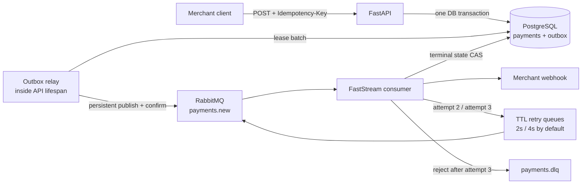

# Async Payment Service

Асинхронный сервис обработки платежей на FastAPI, PostgreSQL и RabbitMQ. Приём платежа
не зависит от доступности брокера: платёж и событие записываются атомарно, а публикация
происходит через transactional outbox с publisher confirms.

## Что реализовано

- `POST /api/v1/payments` возвращает `202 Accepted`; `GET /api/v1/payments/{id}` показывает
  состояние платежа и доставки webhook.
- Обязательные `X-API-Key` и `Idempotency-Key`, включая безопасную конкурентную
  идемпотентность на уровне PostgreSQL.
- `Decimal`/`NUMERIC(18, 2)`, валюты `RUB`, `USD`, `EUR`, JSON metadata и статусы
  `pending`, `succeeded`, `failed`.
- Transactional outbox, lease-based relay, quorum RabbitMQ queues и подтверждение
  каждой публикации брокером.
- Один асинхронный FastStream consumer, детерминированная эмуляция обработки 2–5 секунд
  с вероятностью успеха 90%.
- Webhook с HMAC-SHA256 подписью, тремя попытками в durable retry-очередях и
  экспоненциальными задержками;
  исчерпанные и некорректные события попадают в DLQ.
- Защита webhook от очевидного SSRF, структурированные JSON-логи, Alembic, Docker Compose,
  unit- и сквозные Docker-тесты, CI.

## Соответствие заданию

| Требование | Где реализовано | Как проверяется |
|---|---|---|
| Модели и миграции `payments`, `outbox` | [`db/models.py`](src/payment_service/db/models.py), [`migrations/versions/0001_initial.py`](migrations/versions/0001_initial.py) | `docker compose run --rm migrate`, CHECK/UNIQUE constraints |
| `POST /api/v1/payments` → `202`, `GET /api/v1/payments/{id}` | [`api/routes.py`](src/payment_service/api/routes.py), [`api/schemas.py`](src/payment_service/api/schemas.py) | `tests/unit/test_api.py`, e2e |
| `Idempotency-Key` обязателен, защита от дублей | [`application/payments.py`](src/payment_service/application/payments.py) — `INSERT ... ON CONFLICT` + fingerprint тела | e2e: 8 конкурентных запросов → один платёж, другой body → `409` |
| `X-API-Key` для всех эндпоинтов | [`api/dependencies.py`](src/payment_service/api/dependencies.py), constant-time сравнение | `test_api.py`, e2e `401` |
| Outbox pattern, событие в `payments.new` | [`messaging/outbox.py`](src/payment_service/messaging/outbox.py) — lease + `SKIP LOCKED` + publisher confirms | e2e: платёж принят при остановленном RabbitMQ и доставлен после старта |
| Один consumer: gateway 2–5 с / 90 %, статус в БД, webhook | [`consumer/app.py`](src/payment_service/consumer/app.py), [`consumer/processor.py`](src/payment_service/consumer/processor.py), [`consumer/gateway.py`](src/payment_service/consumer/gateway.py) | `test_processor.py`, `test_gateway.py`, e2e |
| Retry: 3 попытки с экспоненциальной задержкой | [`messaging/topology.py`](src/payment_service/messaging/topology.py) — TTL-очереди `payments.retry.{2,3}` | e2e: интервалы между попытками ≥ 1 с и ≥ 2 с |
| DLQ после 3 попыток | `payments.dlx` → `payments.dlq`, `x-dead-letter-strategy=at-least-once` | e2e: `always-fail` и повреждённые сообщения оказываются в `payments.dlq` |
| Docker: postgres, rabbitmq, api, consumer | [`compose.yaml`](compose.yaml), [`Dockerfile`](Dockerfile) (multi-stage, non-root) | `docker compose up --build`, CI `e2e` job |
| README с запуском и примерами | этот файл | — |

## Архитектура



Outbox-relay запущен в lifespan API, поэтому в базовом Compose остаются ровно требуемые
постоянные сервисы `postgres`, `rabbitmq`, `api` и `consumer` плюс одноразовая миграция.
Несколько API-реплик могут безопасно публиковать параллельно: строки захватываются через
короткий lease и `FOR UPDATE SKIP LOCKED`, а сетевой вызов не держит открытую DB-транзакцию.

### Почему такая структура

`api` отвечает за HTTP, валидацию и аутентификацию; `application` — за создание и поиск
платежа; `db` — за состояние и ограничения; `messaging` — за Outbox и topology;
`consumer` — за последовательность gateway → фиксация результата → webhook.
Gateway и webhook передаются процессору через небольшие Protocol-интерфейсы, поэтому
сценарии ошибок можно проверять без внешней сети.

Платёж и уведомление имеют независимые состояния: недоступность webhook не переводит
успешно обработанный платёж в `failed`. Счётчик webhook хранится в БД, а не только в
заголовке сообщения: дубликаты не получают новый бюджет попыток. Денежная сумма хранится
как `NUMERIC(18, 2)`; fingerprint строится из нормализованной суммы и JSON с сортировкой
ключей. Уникальный индекс плюс `INSERT ... ON CONFLICT` разрешают конкурентные запросы
без предварительного небезопасного «проверить, потом вставить».

### Гарантии доставки

Система даёт **at-least-once**, а не exactly-once:

1. `payments` и соответствующая строка `outbox` создаются в одной транзакции.
2. Relay помечает событие опубликованным только после RabbitMQ publisher confirm.
3. Сбой после подтверждения брокера, но до `published_at`, может создать дубль. Consumer
   повторно не запускает gateway для терминального платежа и не меняет его исход.
4. Webhook также at-least-once: стабильный `X-Webhook-Event-Id` позволяет получателю
   дедуплицировать редкий повтор после HTTP `2xx`, если consumer упал до фиксации результата.

| Момент сбоя | Восстановление |
|---|---|
| До commit создания | Откатываются и платёж, и событие; клиент повторяет запрос с тем же ключом |
| После commit, RabbitMQ недоступен | API возвращает `202`, событие остаётся в Outbox до восстановления брокера |
| После broker confirm, до `published_at` | Возможен повтор события; consumer проверяет сохранённое состояние |
| После результата gateway, до записи в БД | Эмулятор при повторе выдаёт тот же результат для `payment_id` |
| После записи результата, до webhook | Gateway повторно не вызывается; продолжается доставка webhook |
| Во время webhook при жёстком завершении consumer | Unacked сообщение возвращается; новый обработчик ждёт истечения lease |
| После HTTP `2xx`, до commit доставки | Возможен повтор webhook; получатель дедуплицирует `event_id` |
| Три технические ошибки | Событие отправляется в DLQ; состояние самого платежа сохраняется |

Бизнес-результат `failed` (10%) — штатный терминальный статус: он отправляется webhook и
ACK-ается. В DLQ уходят технические/невалидные события или webhook, не принятый за три
попытки.

### RabbitMQ topology

| Entity | Назначение |
|---|---|
| `payments.events` | durable direct exchange для новых событий |
| `payments.new` | основная durable queue, routing key `payments.new` |
| `payments.retry` | durable direct exchange повторов |
| `payments.retry.2` | TTL 2 секунды, затем DLX обратно в `payments.new` |
| `payments.retry.3` | TTL 4 секунды, затем DLX обратно в `payments.new` |
| `payments.dlx` / `payments.dlq` | финальная dead-letter exchange/queue |

TTL рассчитывается как `RETRY_BASE_DELAY_SECONDS * 2^(attempt-2)`. Настройка topology
должна быть одинаковой у API и consumer; Compose передаёт им общий набор переменных.

Основная, retry- и dead-letter очереди — quorum. В основной и retry-очередях включены
`x-dead-letter-strategy=at-least-once` и `x-overflow=reject-publish`: исходная очередь
удерживает сообщение до подтверждения принимающей очереди. Обычный classic DLX этого
не гарантирует. `x-delivery-limit=-1` отключает отдельный брокерный лимит redelivery;
три прикладные попытки контролируются процессором. Так ожидание занятого lease после
crash не исчерпывает лимит RabbitMQ раньше попытки отправки webhook.

JSON декодируется внутри consumer: повреждённый JSON, неверная кодировка, массив вместо
объекта и несовместимая версия события явно отклоняются в DLQ, а не зависают unacked
при ошибке десериализации до входа в обработчик.

## Быстрый запуск

Нужны Docker с Compose и свободные порты `8000` и `15672`.
Для `make test-e2e` требуется Compose >= 2.24.4 (`!override` для изолированных портов),
Python >= 3.12 и [uv](https://docs.astral.sh/uv/).

```bash
cp .env.example .env
docker compose up --build -d
docker compose ps
```

Swagger UI: <http://localhost:8000/docs>. Страница и `/openapi.json` локально открыты
(`PUBLIC_DOCS=true`), потому что браузер не может передать `X-API-Key` при загрузке самой
страницы. Все бизнес- и health-эндпоинты требуют ключ: в UI нажмите **Authorize** и введите
`local-development-key`. `PUBLIC_DOCS=false` закрывает ключом и документацию:

```bash
curl --fail-with-body -H 'X-API-Key: local-development-key' \
  http://localhost:8000/openapi.json
```

RabbitMQ Management:
<http://localhost:15672> (`payments` / `payments` только для локального окружения).

Создать платёж:

```bash
curl --fail-with-body -X POST http://localhost:8000/api/v1/payments \
  -H 'Content-Type: application/json' \
  -H 'X-API-Key: local-development-key' \
  -H 'Idempotency-Key: merchant-order-A-1042' \
  -d '{
    "amount": "1499.90",
    "currency": "RUB",
    "description": "Order #A-1042",
    "metadata": {"order_id": "A-1042", "customer_id": 321},
    "webhook_url": "https://merchant.example/webhooks/payments"
  }'
```

Сумму рекомендуется передавать JSON-строкой. JSON float отвергается, чтобы двоичное
представление не искажало деньги. Ответ:

```json
{
  "payment_id": "98ce20cc-e407-4881-87ea-c247218668d8",
  "status": "pending",
  "created_at": "2026-08-01T12:00:00Z"
}
```

Повтор с тем же ключом и тем же семантическим телом вернёт тот же `payment_id` и заголовок
`Idempotent-Replayed: true`. Тот же ключ с другим телом вернёт `409 Conflict`.

```bash
curl --fail-with-body \
  -H 'X-API-Key: local-development-key' \
  http://localhost:8000/api/v1/payments/98ce20cc-e407-4881-87ea-c247218668d8
```

Остановить сервисы, сохранив данные:

```bash
docker compose down
```

## Webhook

Успешным считается только HTTP `2xx`; redirects не выполняются. Тело — канонический JSON
(сортированные ключи, без пробелов, UTF-8):

```json
{
  "amount": "1499.90",
  "currency": "RUB",
  "description": "Order #A-1042",
  "event_id": "5d2d9d0e-7a7c-4a52-9d3e-0b1f5f6e1a11",
  "event_type": "payment.succeeded",
  "metadata": {"customer_id": 321, "order_id": "A-1042"},
  "payment_id": "98ce20cc-e407-4881-87ea-c247218668d8",
  "processed_at": "2026-08-01T12:00:03.214Z",
  "status": "succeeded"
}
```

| Заголовок | Значение |
|---|---|
| `X-Webhook-Event-Id` | стабильный ID события; одинаков во всех попытках, ключ дедупликации |
| `X-Webhook-Attempt` | номер попытки `1..3` |
| `X-Webhook-Timestamp` | Unix time отправки, защита от replay |
| `X-Webhook-Signature` | `sha256=<hex HMAC-SHA256(secret, "{timestamp}." + body)>` |

Подпись включается при заданном `WEBHOOK_SIGNING_SECRET` (в production обязателен).
Получатель проверяет подпись над сырыми байтами тела и отклоняет запросы, у которых
`timestamp` отличается от текущего времени больше чем на допуск (по умолчанию 5 минут):

```python
import hmac, hashlib, time


def verify(secret: str, body: bytes, timestamp: str, signature: str) -> bool:
    if abs(time.time() - int(timestamp)) > 300:
        return False
    expected = hmac.new(secret.encode(), f"{timestamp}.".encode() + body, hashlib.sha256)
    return hmac.compare_digest(f"sha256={expected.hexdigest()}", signature)
```

Та же функция доступна как `payment_service.consumer.webhook.verify_webhook_signature`;
e2e webhook-sink использует её и отвергает неподписанные запросы.

По умолчанию разрешён только HTTPS и запрещены localhost, private/link-local/reserved IP,
URL с credentials и имена, которые резолвятся в непубличный адрес.
`ALLOW_PRIVATE_WEBHOOKS=true` и `REQUIRE_HTTPS_WEBHOOKS=false` предназначены только для
локальных/e2e-сценариев. Для production дополнительно нужен egress firewall/proxy: проверка
в приложении сама по себе не устраняет DNS rebinding.

Webhook delivery сериализуется DB-backed lease с owner token. Дубликаты одного Rabbit event
не могут параллельно занять весь retry budget, cancellation освобождает claim без расхода
попытки, а завершение error/success выполняется compare-and-set. Если сообщение вернулось
после crash предыдущего владельца, пока lease ещё активен, оно остаётся unacked и
переотправляется через bounded `NACK requeue` — recovery-trigger не теряется. Общий deadline
охватывает DNS и HTTP. Жёсткий crash после HTTP и до DB commit всё ещё допускает повтор
webhook — это ожидаемая at-least-once семантика, поэтому получатель обязан дедуплицировать
стабильный `X-Webhook-Event-Id`.

После трёх неудач исходное сообщение можно увидеть в `payments.dlq` через RabbitMQ
Management. Replay из DLQ — осознанная операторская операция: сначала устраняется причина,
затем восстанавливается бюджет доставки и сообщение с прежним event ID переиздаётся в
`payments.events` с routing key `payments.new`. Автоматического сброса бюджета нет:
простой replay после исчерпания трёх webhook-попыток снова отправит событие в DLQ.
Сброс должен быть отдельной контролируемой операцией с блокировкой строки платежа.
Replay уже доставленного события — no-op, он не вызывает gateway или webhook повторно.

## Проверки

```bash
uv sync --frozen --all-groups
make lint       # ruff format/check + strict mypy
make test       # unit tests, branch coverage >= 85%
make test-e2e   # real PostgreSQL + RabbitMQ + API + consumer + webhook sink
```

E2E-тест создаёт отдельный Compose project с автоматически выделенными портами и
проверяет:

- обязательный API key, атомарное создание одного платежа и одного outbox-события;
- восемь конкурентных запросов с одним ключом, replay и конфликт `409`;
- цепочку `503 → 503 → 200` с измерением экспоненциальных задержек и стабильным event ID;
- повтор уже доставленного Rabbit-события без второго webhook;
- восстановление после `SIGKILL` consumer во время webhook с активным DB lease;
- приём платежа при остановленном RabbitMQ и доставку после его запуска;
- DLQ после трёх `503` и DLQ для повреждённых сообщений.

Временные контейнеры и volumes удаляются при выходе, включая ошибку/прерывание.
CI выполняет unit и e2e в отдельных jobs. E2E настройки ускоряют эмулятор и retry;
обычный Compose сохраняет задержки 2–5 секунд и вероятность успеха 90%.

## Конфигурация

Основные переменные перечислены в `.env.example`:

| Переменная | Default | Значение |
|---|---:|---|
| `ENVIRONMENT` | `development` | `production` включает fail-fast security checks |
| `API_KEY` | `local-development-key` | локальный ключ; обязательно заменить вне local |
| `PUBLIC_DOCS` | `true` | `/docs` и `/openapi.json` без ключа; `false` — защищены как всё остальное |
| `DATABASE_URL` | — | asyncpg DSN PostgreSQL |
| `RABBITMQ_URL` | — | AMQP DSN; хранится как secret setting |
| `RABBIT_PUBLISH_TIMEOUT_SECONDS` | `10` | deadline ожидания publisher confirm |
| `DATABASE_READINESS_TIMEOUT_SECONDS` | `1.5` | внутренний deadline readiness query |
| `PAYMENT_MIN_DELAY_SECONDS` | `2` | минимальная задержка gateway |
| `PAYMENT_MAX_DELAY_SECONDS` | `5` | максимальная задержка gateway |
| `PAYMENT_SUCCESS_RATE` | `0.9` | вероятность бизнес-успеха |
| `RETRY_BASE_DELAY_SECONDS` | `2` | база exponential backoff |
| `MAX_DELIVERY_ATTEMPTS` | `3` | фиксировано требованиями задания |
| `WEBHOOK_LEASE_SECONDS` | `30` | lease для сериализации доставки; больше HTTP timeout |
| `WEBHOOK_BUSY_RETRY_DELAY_SECONDS` | `1` | пауза перед requeue занятого claim |
| `REQUIRE_HTTPS_WEBHOOKS` | `true` | запрет plaintext webhook |
| `ALLOW_PRIVATE_WEBHOOKS` | `false` | разрешить private targets только локально |
| `WEBHOOK_SIGNING_SECRET` | local placeholder | секрет HMAC-подписи webhook; в production >= 32 символов |

Все эндпоинты API, включая `GET /health/live` и `GET /health/ready`, требуют `X-API-Key`;
`/docs` и `/openapi.json` — тоже, если `PUBLIC_DOCS=false` (так работает e2e). Docker
healthcheck передаёт ключ из окружения контейнера. Readiness проверяет PostgreSQL, но не RabbitMQ: временно
недоступный брокер не мешает безопасно принимать платежи в transactional outbox.

## Разработка и миграции

```bash
make install
docker compose run --rm migrate
docker compose run --rm migrate alembic downgrade base
```

`.env.example` содержит hostname `postgres`, доступный внутри Compose network. Для запуска
Alembic напрямую с host нужно передать отдельный `DATABASE_URL` с host-visible PostgreSQL.

Первая миграция создаёт `payments`, `outbox`, ограничения валют/статусов/суммы/трёх попыток,
unique idempotency key и partial polling index для неопубликованного outbox.

```text
src/payment_service/
├── api/          # HTTP transport, auth, schemas
├── application/  # create/get payment use cases and fingerprint
├── consumer/     # gateway, webhook, idempotent processor, FastStream runner
├── db/           # SQLAlchemy models and async sessions
└── messaging/    # event schema, Rabbit topology, outbox relay
```

## Production notes

- Один RabbitMQ в Compose нужен для воспроизводимого локального запуска. Для отказа
  целого узла quorum queues требуют production-кластер из минимум трёх узлов;
  локальные гарантии предполагают сохранность PostgreSQL/RabbitMQ volumes.
- Тип существующей RabbitMQ-очереди нельзя менять декларацией. Если окружение запускалось
  со старой classic topology, её нужно мигрировать отдельно; обновление поверх непустых
  старых очередей не выполняет автоматическое удаление сообщений.
- Production-конфигурация fail-fast отклоняет локальный API key, HTTP/private webhook и
  отсутствующий секрет подписи; секреты должны поступать из secret manager, а не из
  `.env` или Compose defaults.
- Для multi-tenant продукта нужны merchant-scoped credentials/ownership и секрет подписи
  на каждого получателя; единый API key и общий секрет достаточны только для scope
  тестового задания.
- TLS, rate/body limits и сетевой egress обычно обеспечиваются ingress/service mesh.
- Для большой нагрузки relay можно вынести в отдельный deployment без изменения модели
  данных; lease/`SKIP LOCKED` уже поддерживает горизонтальное масштабирование.
- Нужны метрики/alerts по возрасту unpublished outbox, глубине retry/DLQ, latency обработки
  и доле ошибок webhook.
- При большом числе получателей полезны per-host concurrency limits и circuit breaker;
  текущий consumer ограничивает зависание HTTP timeout и не держит сообщение во время
  backoff, но намеренно остаётся одним consumer-процессом по условию задания.
- Реальный side-effecting payment provider должен принимать `payment_id` как idempotency key
  либо иметь собственный processing lease; simulator детерминирован, но несколько consumer-
  реплик иначе могут одновременно начать внешний gateway call до terminal-state CAS.

## References

- [RabbitMQ: Time-To-Live and Expiration](https://www.rabbitmq.com/docs/ttl)
- [RabbitMQ: Dead Letter Exchanges](https://www.rabbitmq.com/docs/dlx)
- [RabbitMQ: Publisher Confirms](https://www.rabbitmq.com/docs/confirms)
- [RabbitMQ: Quorum Queues and reliable dead lettering](https://www.rabbitmq.com/docs/4.1/quorum-queues)
- [FastStream: RabbitMQ publishing](https://faststream.ag2.ai/latest/rabbit/publishing/)
