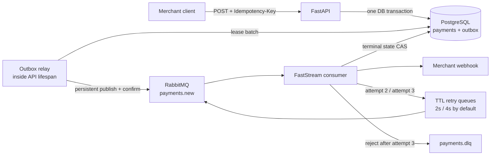

# Async Payment Service

Асинхронный сервис обработки платежей на FastAPI, PostgreSQL и RabbitMQ. Приём платежа
не зависит от доступности брокера: платёж и событие записываются атомарно, а публикация
происходит через transactional outbox с publisher confirms.

## Что реализовано

- `POST /api/v1/payments` возвращает `202 Accepted`; `GET /api/v1/payments/{id}` показывает
  состояние платежа и доставки webhook.
- Обязательные `X-API-Key` и `Idempotency-Key`, включая безопасную конкурентную
  идемпотентность на уровне PostgreSQL.
- `Decimal`/`NUMERIC(18, 2)`, валюты `RUB`, `USD`, `EUR`, JSON metadata и статусы
  `pending`, `succeeded`, `failed`.
- Transactional outbox, lease-based relay, durable RabbitMQ topology и подтверждение
  каждой публикации брокером.
- Один асинхронный FastStream consumer, детерминированная эмуляция обработки 2–5 секунд
  с вероятностью успеха 90%.
- Webhook с тремя попытками в durable retry-очередях и экспоненциальными задержками;
  исчерпанные и некорректные события попадают в DLQ.
- Защита webhook от очевидного SSRF, структурированные JSON-логи, Alembic, Docker Compose,
  unit- и сквозные Docker-тесты, CI.

## Архитектура



Outbox-relay запущен в lifespan API, поэтому в базовом Compose остаются ровно требуемые
постоянные сервисы `postgres`, `rabbitmq`, `api` и `consumer` плюс одноразовая миграция.
Несколько API-реплик могут безопасно публиковать параллельно: строки захватываются через
короткий lease и `FOR UPDATE SKIP LOCKED`, а сетевой вызов не держит открытую DB-транзакцию.

### Гарантии доставки

Система даёт **at-least-once**, а не exactly-once:

1. `payments` и соответствующая строка `outbox` создаются в одной транзакции.
2. Relay помечает событие опубликованным только после RabbitMQ publisher confirm.
3. Сбой после подтверждения брокера, но до `published_at`, может создать дубль. Consumer
   повторно не запускает gateway для терминального платежа и не меняет его исход.
4. Webhook также at-least-once: стабильный `X-Webhook-Event-Id` позволяет получателю
   дедуплицировать редкий повтор после HTTP `2xx`, если consumer упал до фиксации результата.

Бизнес-результат `failed` (10%) — штатный терминальный статус: он отправляется webhook и
ACK-ается. В DLQ уходят технические/невалидные события или webhook, не принятый за три
попытки.

### RabbitMQ topology

| Entity | Назначение |
|---|---|
| `payments.events` | durable direct exchange для новых событий |
| `payments.new` | основная durable queue, routing key `payments.new` |
| `payments.retry` | durable direct exchange повторов |
| `payments.retry.2` | TTL 2 секунды, затем DLX обратно в `payments.new` |
| `payments.retry.3` | TTL 4 секунды, затем DLX обратно в `payments.new` |
| `payments.dlx` / `payments.dlq` | финальная dead-letter exchange/queue |

TTL рассчитывается как `RETRY_BASE_DELAY_SECONDS * 2^(attempt-2)`. Настройка topology
должна быть одинаковой у API и consumer; Compose передаёт им общий набор переменных.

## Быстрый запуск

Нужны Docker с Compose и свободные порты `8000` и `15672`.

```bash
cp .env.example .env
docker compose up --build -d
docker compose ps
```

Swagger UI: <http://localhost:8000/docs>. RabbitMQ Management:
<http://localhost:15672> (`payments` / `payments` только для локального окружения).

Создать платёж:

```bash
curl --fail-with-body -X POST http://localhost:8000/api/v1/payments \
  -H 'Content-Type: application/json' \
  -H 'X-API-Key: local-development-key' \
  -H 'Idempotency-Key: merchant-order-A-1042' \
  -d '{
    "amount": "1499.90",
    "currency": "RUB",
    "description": "Order #A-1042",
    "metadata": {"order_id": "A-1042", "customer_id": 321},
    "webhook_url": "https://merchant.example/webhooks/payments"
  }'
```

Сумму рекомендуется передавать JSON-строкой. JSON float отвергается, чтобы двоичное
представление не искажало деньги. Ответ:

```json
{
  "payment_id": "98ce20cc-e407-4881-87ea-c247218668d8",
  "status": "pending",
  "created_at": "2026-08-01T12:00:00Z"
}
```

Повтор с тем же ключом и тем же семантическим телом вернёт тот же `payment_id` и заголовок
`Idempotent-Replayed: true`. Тот же ключ с другим телом вернёт `409 Conflict`.

```bash
curl --fail-with-body \
  -H 'X-API-Key: local-development-key' \
  http://localhost:8000/api/v1/payments/98ce20cc-e407-4881-87ea-c247218668d8
```

Остановить сервисы, сохранив данные:

```bash
docker compose down
```

## Webhook

Успешным считается только HTTP `2xx`; redirects не выполняются. В payload передаются
`event_id`, `event_type`, `payment_id`, `status`, `amount`, `currency`, `processed_at`, а в
заголовках — стабильный `X-Webhook-Event-Id` и номер `X-Webhook-Attempt`.

По умолчанию разрешён только HTTPS и запрещены localhost, private/link-local/reserved IP,
URL с credentials и имена, которые резолвятся в непубличный адрес.
`ALLOW_PRIVATE_WEBHOOKS=true` и `REQUIRE_HTTPS_WEBHOOKS=false` предназначены только для
локальных/e2e-сценариев. Для production дополнительно нужен egress firewall/proxy: проверка
в приложении сама по себе не устраняет DNS rebinding.

Webhook delivery сериализуется DB-backed lease с owner token. Дубликаты одного Rabbit event
не могут параллельно занять весь retry budget, cancellation освобождает claim без расхода
попытки, а завершение error/success выполняется compare-and-set. Если сообщение вернулось
после crash предыдущего владельца, пока lease ещё активен, оно остаётся unacked и
переотправляется через bounded `NACK requeue` — recovery-trigger не теряется. Общий deadline
охватывает DNS и HTTP. Жёсткий crash после HTTP и до DB commit всё ещё допускает повтор
webhook — это ожидаемая at-least-once семантика, поэтому получатель обязан дедуплицировать
стабильный `X-Webhook-Event-Id`.

После трёх неудач исходное сообщение можно увидеть в `payments.dlq` через RabbitMQ
Management. Replay из DLQ — осознанная операторская операция: сначала устраняется причина,
затем сообщение переиздаётся в `payments.events` с routing key `payments.new`; стабильный
event ID и состояние платежа делают повторную обработку безопасной.

## Проверки

```bash
uv sync --frozen --all-groups
make lint       # ruff format/check + strict mypy
make test       # unit tests, branch coverage >= 85%
make test-e2e   # real PostgreSQL + RabbitMQ + API + consumer + webhook sink
```

E2E-тест использует отдельный Compose project, проверяет цепочку `503 → 503 → 200`, восемь
конкурентных запросов с одним ключом, replay, конфликт идемпотентности и DLQ после трёх
`503`. Его временные контейнеры и volumes всегда удаляются. CI выполняет unit и e2e в
отдельных jobs.

## Конфигурация

Основные переменные перечислены в `.env.example`:

| Переменная | Default | Значение |
|---|---:|---|
| `ENVIRONMENT` | `development` | `production` включает fail-fast security checks |
| `API_KEY` | `local-development-key` | локальный ключ; обязательно заменить вне local |
| `DATABASE_URL` | — | asyncpg DSN PostgreSQL |
| `RABBITMQ_URL` | — | AMQP DSN; хранится как secret setting |
| `RABBIT_PUBLISH_TIMEOUT_SECONDS` | `10` | deadline ожидания publisher confirm |
| `DATABASE_READINESS_TIMEOUT_SECONDS` | `1.5` | внутренний deadline readiness query |
| `PAYMENT_MIN_DELAY_SECONDS` | `2` | минимальная задержка gateway |
| `PAYMENT_MAX_DELAY_SECONDS` | `5` | максимальная задержка gateway |
| `PAYMENT_SUCCESS_RATE` | `0.9` | вероятность бизнес-успеха |
| `RETRY_BASE_DELAY_SECONDS` | `2` | база exponential backoff |
| `MAX_DELIVERY_ATTEMPTS` | `3` | фиксировано требованиями задания |
| `WEBHOOK_LEASE_SECONDS` | `30` | lease для сериализации доставки; больше HTTP timeout |
| `WEBHOOK_BUSY_RETRY_DELAY_SECONDS` | `1` | пауза перед requeue занятого claim |
| `REQUIRE_HTTPS_WEBHOOKS` | `true` | запрет plaintext webhook |
| `ALLOW_PRIVATE_WEBHOOKS` | `false` | разрешить private targets только локально |

`GET /health/live` и `GET /health/ready` намеренно публичны для оркестратора; все бизнес-
эндпоинты требуют `X-API-Key`. Readiness проверяет PostgreSQL, но не RabbitMQ: временно
недоступный брокер не мешает безопасно принимать платежи в transactional outbox.

## Разработка и миграции

```bash
make install
docker compose run --rm migrate
docker compose run --rm migrate alembic downgrade base
```

`.env.example` содержит hostname `postgres`, доступный внутри Compose network. Для запуска
Alembic напрямую с host нужно передать отдельный `DATABASE_URL` с host-visible PostgreSQL.

Первая миграция создаёт `payments`, `outbox`, ограничения валют/статусов/суммы/трёх попыток,
unique idempotency key и partial polling index для неопубликованного outbox.

```text
src/payment_service/
├── api/          # HTTP transport, auth, schemas
├── application/  # create/get payment use cases and fingerprint
├── consumer/     # gateway, webhook, idempotent processor, FastStream runner
├── db/           # SQLAlchemy models and async sessions
└── messaging/    # event schema, Rabbit topology, outbox relay
```

## Production notes

- Production-конфигурация fail-fast отклоняет локальный API key, HTTP/private webhook;
  секреты должны поступать из secret manager, а не из `.env` или Compose defaults.
- Для multi-tenant продукта нужны merchant-scoped credentials/ownership и HMAC-подпись
  webhook; единый API key достаточен только для scope тестового задания.
- TLS, rate/body limits и сетевой egress обычно обеспечиваются ingress/service mesh.
- Для большой нагрузки relay можно вынести в отдельный deployment без изменения модели
  данных; lease/`SKIP LOCKED` уже поддерживает горизонтальное масштабирование.
- Нужны метрики/alerts по возрасту unpublished outbox, глубине retry/DLQ, latency обработки
  и доле ошибок webhook.
- При большом числе получателей полезны per-host concurrency limits и circuit breaker;
  текущий consumer ограничивает зависание HTTP timeout и не держит сообщение во время
  backoff, но намеренно остаётся одним consumer-процессом по условию задания.
- Реальный side-effecting payment provider должен принимать `payment_id` как idempotency key
  либо иметь собственный processing lease; simulator детерминирован, но несколько consumer-
  реплик иначе могут одновременно начать внешний gateway call до terminal-state CAS.

## References

- [RabbitMQ: Time-To-Live and Expiration](https://www.rabbitmq.com/docs/ttl)
- [RabbitMQ: Dead Letter Exchanges](https://www.rabbitmq.com/docs/dlx)
- [RabbitMQ: Publisher Confirms](https://www.rabbitmq.com/docs/confirms)
- [FastStream: RabbitMQ publishing](https://faststream.ag2.ai/latest/rabbit/publishing/)
